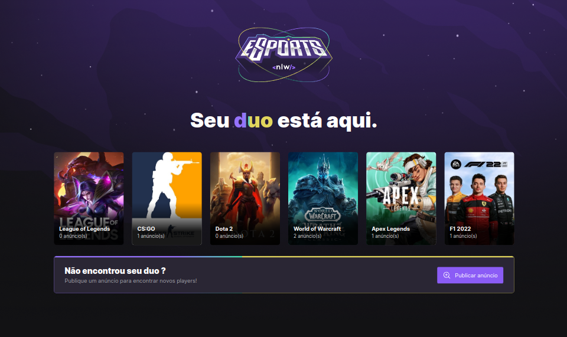
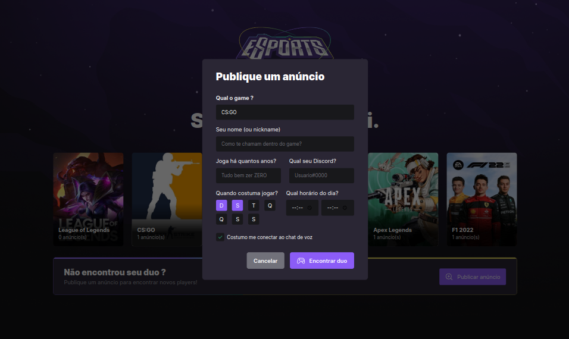
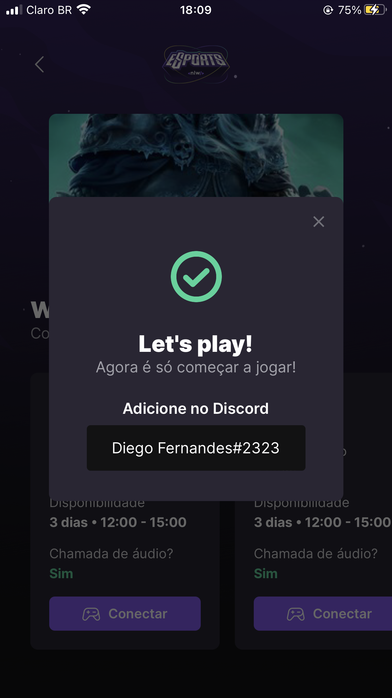

# NLW - eSports 🚀

O Next Level Week é um evento totalmente online, gratuito e mão na massa promovido pela Rocketseat com muito código, desafios, networking e um único objetivo: te levar para o próximo nível, seja qual for o seu momento de carreira.

# 📜 Sobre

Foi desenvolvido a versão web e mobile do Find your Duo, uma plataforma que ajuda gamers a encontrar um parceiro ou parceira para jogar online seu game favorito, conectado a Twitch.

# 🧑‍💻 Tecnologias utilizadas

- [React](https://pt-br.reactjs.org/);
- [Vite.js](https://vitejs.dev/);
- [TailwindCSS](https://tailwindcss.com/);
- [RadixUi](https://www.radix-ui.com/);
- [TypeScript](https://www.typescriptlang.org/);
- [Node.js](https://nodejs.org/en/);
- [SQLite](https://www.sqlite.org/docs.html);
- [Prisma](https://www.prisma.io/);
- [React Native](https://reactnative.dev/);
- [React Navigation](https://reactnavigation.org/);
- [Expo](https://docs.expo.dev/);
- [Figma](https://www.figma.com/file/P5utnKHITPXU5yjDUaP9T1/NLW-eSports-(Community)?node-id=0%3A1).

# 🖥️ Versão Web

    
    

# 📱 Versão Mobile

    
    
    

#

Desafio feito pela / [@Rocketseat](https://github.com/Rocketseat)